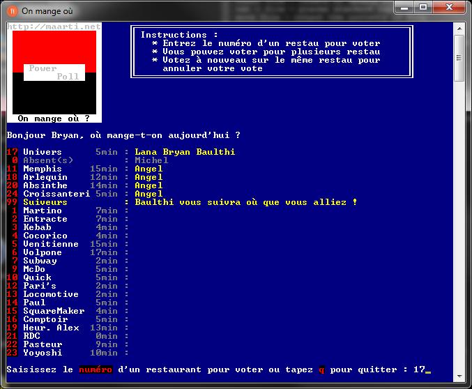

# [PowerPoll](https://github.com/Maarti/PowerPoll)
PowerShell poll program for my co-workers to decide where to eat each day :)

## Overview



## Configuration
* `./dat/restaurants.xml` contains restaurants information :
  * `"id"` must be unique, different from "q","Q" or "quit"
  * `<name>` should be a maximum size of 12 for layout reasons
  * `<time>` represents the travel time (in min) to the restaurant by foot
* `./dat/users.xml` contains users informations :
  * `"id"` of each user **should match their Windows session id** *(use `$env:UserName` in PowerShell to get it)*
  * For now, just the `<prenom>` tag is used. It corresponds to first name of the user.
* `./poll.ps1` contains the main script of the program :
  *  On line 73, **change the absolute path** to match your PowerPoll directory : 
  ```powershell
  # Identification
  Set-Location -Path C:\Users\bryan\workspace\PowerPoll
	```
* You can create a shortcut to launch your script just by clicking on an icon. Create a shortcut and in the target section, write `%SystemRoot%\system32\WindowsPowerShell\v1.0\powershell.exe -noexit -nologo -command &'C:\Users\bryan\workspace\PowerPoll\poll.ps1'` (replace it by the path to your script), like [On mange où.Ink](On%20mange%20où.lnk). 

## Getting started
* Open PowerShell (or PowerShell ISE)
* Move to the project folder `cd .\PowerPoll\`
* Run the script `.\poll.ps1`


## Instructions
* Type a restaurant number to vote for it.
* You can vote for several restaurants.
* Vote for the same restaurant to cancel your vote.
* Vote for `0. Absent(s)` if you are away and don't want to go to the restaurant today.
* Vote for `99. Suiveurs` if you want to go anywhere.


## Disable Execution Policy
If you have this error :
> script1.ps1 cannot be loaded because running scripts is disabled on this system.

This error happens due to a security measure which won't let scripts be executed on your system without you having approved of it.

**Disable it for the current user :**
```bat
Set-ExecutionPolicy -ExecutionPolicy Unrestricted -Scope CurrentUser -Force
```
**Or definitively on the computer :**
```bat
Set-ExecutionPolicy -ExecutionPolicy Unrestricted -Force
```

## Useful information
* [Effective Windows PowerShell ebook](https://rkeithhill.wordpress.com/2009/03/08/effective-windows-powershell-the-free-ebook/) from Keith 


## Author
[Bryan MARTINET](https://maarti.net)